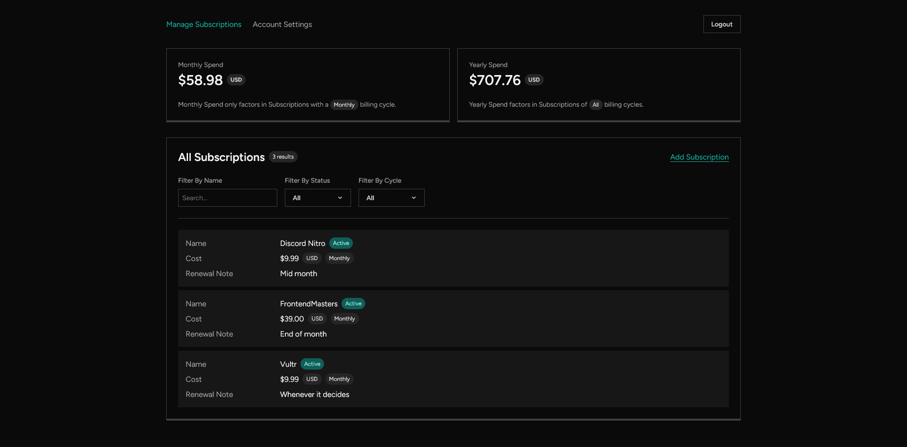

<a name="readme-top"></a>

<div align="center">

<h3 align="center">Subscription Manager</h3>

  <p align="center">
    A simple dashboard to track your recurring subscriptions.
  </p>
</div>



<p align="right">(<a href="#readme-top">back to top</a>)</p>

### Built With

- Laravel 10
- Inertia.js + React
- TailwindCSS

<p align="right">(<a href="#readme-top">back to top</a>)</p>

## Getting Started

### Prerequisites

- npm, composer
- Laravel 10 & its requirements

### Installation

1. Clone the repo

    ```sh
    git clone https://github.com/itsmeslof/subscription-manager.git
    ```

2. Install Composer packages

    ```sh
    composer install
    ```

3. Install npm packages

    ```sh
    npm install
    ```

4. Build assets

    ```sh
    npm run build
    ```

5. Configure your `.env` file
6. Migrate database

    ```sh
    php artisan migrate --force
    ```

7. Run setup command

    ```sh
    php artisan sm:create-default-user # Default login: 'user@example.com', 'password'
    ```

8. Run your php server

After running the setup command, you can login with '<user@example.com>', 'password'. **You should change the default email and password.**

If you lose access to your account, you can run `php artisan sm:reset-default-user` to reset the account login back to default.

<p align="right">(<a href="#readme-top">back to top</a>)</p>

<!-- LICENSE -->

## License

Distributed under the MIT License. See [LICENSE.txt](LICENSE.txt) for more information.

<p align="right">(<a href="#readme-top">back to top</a>)</p>
